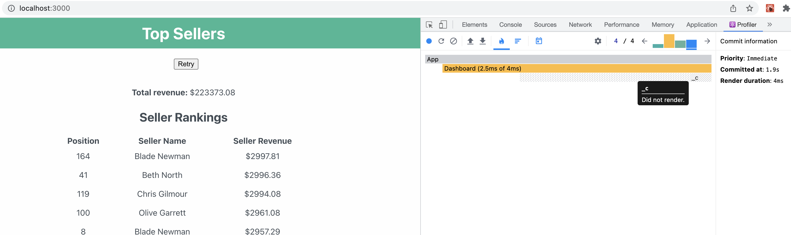

<h1 align="center">
    React.memo Example
     
</h1>

# Overview

The App returns times out frequently so a mechanism to handle these timouts is needed.

* Load the order data using the getOrders function 
* Once all the data is successfully loaded, hide the loading icon
* Calculate and display the total revenue
* Display a ranking showing the sellers ordered by their total revenue using the <SellerRanking /> component. 
* The seller with the highest revenue should be shown at the top with position 1. 
* All the revenue values should only consider Confirmed orders. Canceled orders should be ignored.
* All dollar amounts should be displayed to 2 decimal places
* The getOrders function times out frequently. Display any errors returned while loading the data in the provided div. 
* The retry button should clear the error and reattempt the request
* Additionally I've added React.memo to avoid unnecessary rerenders

 

 

# Getting Started with Create React App

This project was bootstrapped with [Create React App](https://github.com/facebook/create-react-app).
